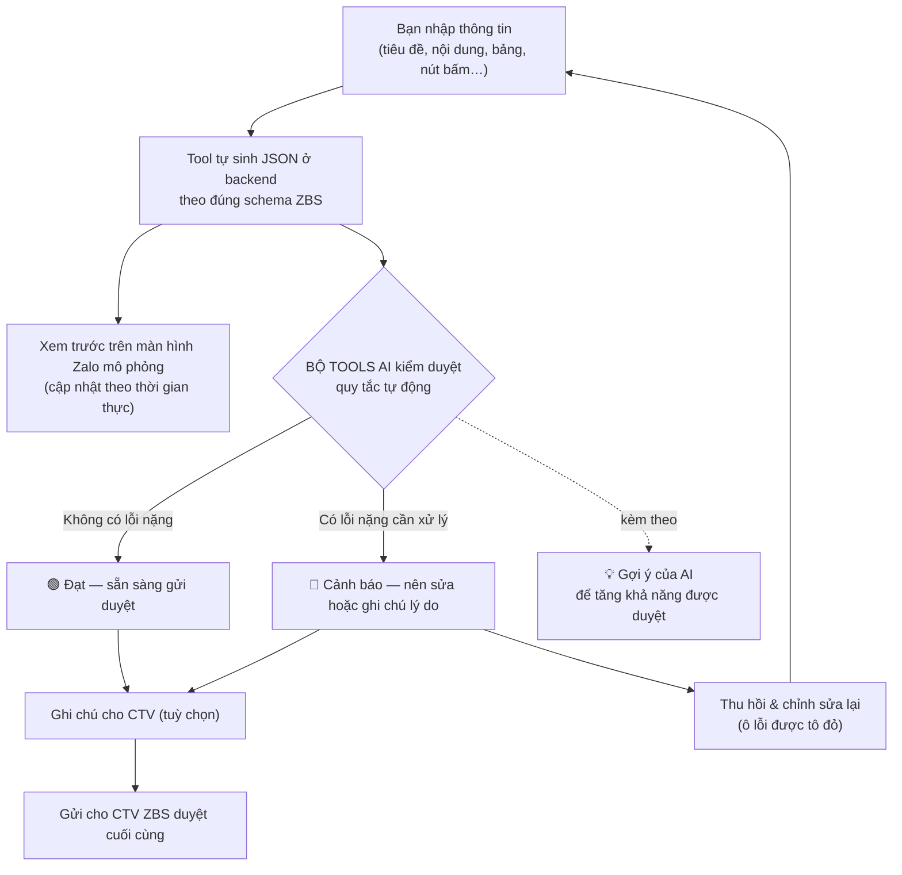
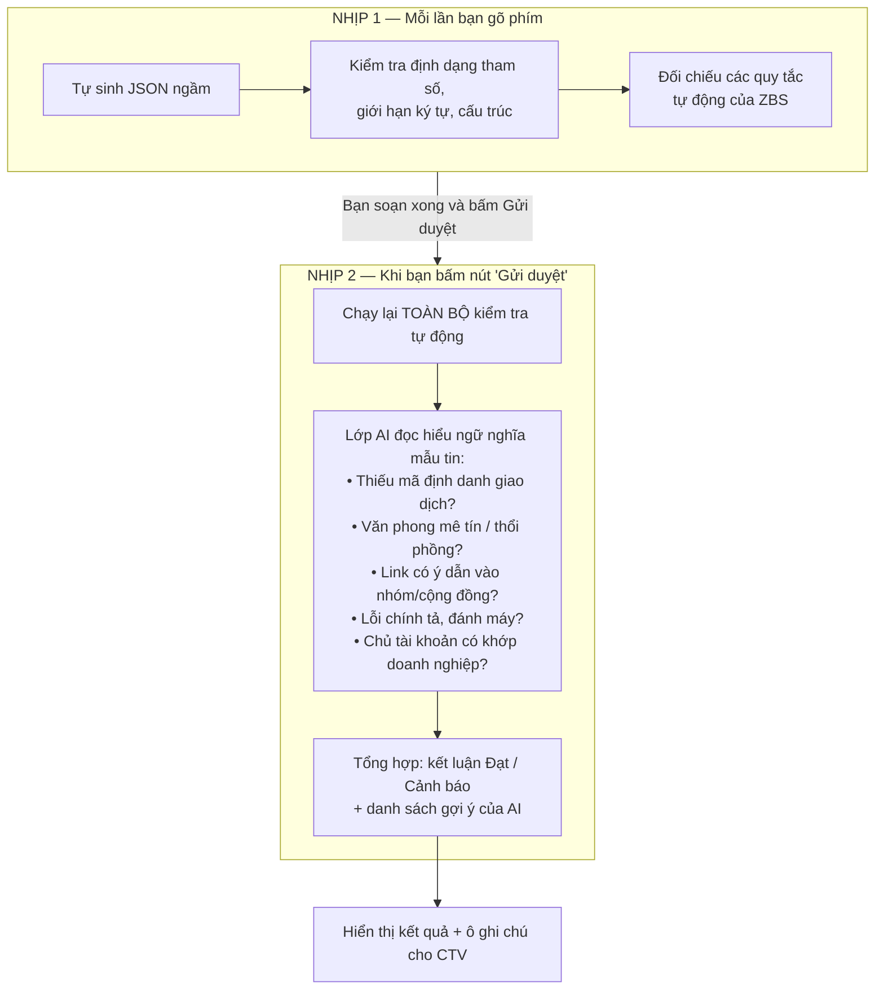
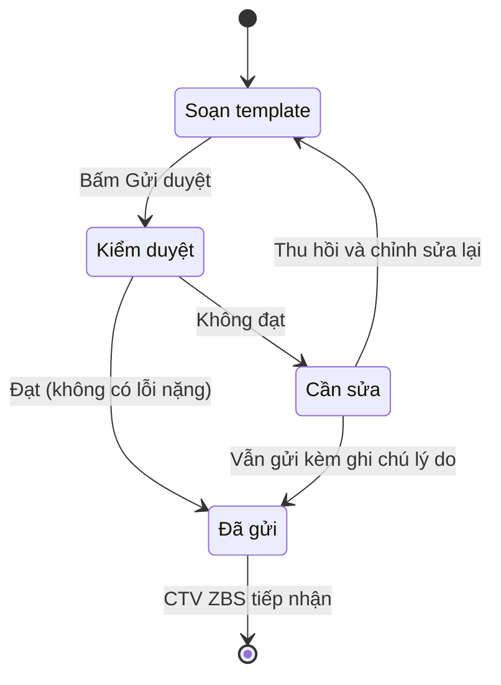

# ZBS Sandbox Studio

### Tôi xây bộ tools AI này với một mong muốn giản dị: để mỗi mẫu tin của bạn được duyệt ngay từ lần gửi đầu tiên.

### ▶️ Dùng thử ngay (bản online): **[zbs-studio-nguyenhoangminh.vercel.app](https://zbs-studio-nguyenhoangminh.vercel.app/)**

---

## 📑 Mục lục

1. [ZBS Sandbox Studio là gì và tôi xây nó để giải quyết điều gì](#1-zbs-sandbox-studio-là-gì-và-tôi-xây-nó-để-giải-quyết-điều-gì)
2. [Sơ đồ luồng xử lý dữ liệu](#2-sơ-đồ-luồng-xử-lý-dữ-liệu)
3. [Hướng dẫn sử dụng theo từng bước](#3-hướng-dẫn-sử-dụng-theo-từng-bước)
4. [Bộ tools AI kiểm duyệt như thế nào — và vai trò của CTV ZBS](#4-bộ-tools-ai-kiểm-duyệt-như-thế-nào--và-vai-trò-của-ctv-zbs)
5. [Năm case mẫu — mỗi case tôi muốn chứng minh một điều](#5-năm-case-mẫu--mỗi-case-tôi-muốn-chứng-minh-một-điều)
6. [Giới hạn ký tự và quy tắc theo Tag](#6-giới-hạn-ký-tự-và-quy-tắc-theo-tag)
7. [Câu hỏi thường gặp](#7-câu-hỏi-thường-gặp)
8. [Cách dùng và ghi chú kỹ thuật](#8-cách-dùng-và-ghi-chú-kỹ-thuật)

---

## 1. ZBS Sandbox Studio là gì và tôi xây nó để giải quyết điều gì

Tôi xin bắt đầu bằng câu chuyện thực tế. Khi một doanh nghiệp muốn gửi tin nhắn ZNS (Zalo Notification Service) qua nền tảng ZBS, mẫu tin đó luôn phải đi qua một vòng kiểm duyệt của Zalo. Vấn đề là rất nhiều mẫu bị **từ chối đi từ chối lại** chỉ vì những lỗi tưởng nhỏ: để số điện thoại trong nội dung thay vì đặt ở nút bấm, thiếu mã đơn hàng để chứng minh đã phát sinh giao dịch, dùng đường link dẫn vào nhóm, hay một lỗi chính tả lọt qua mắt người soạn. Mỗi lần bị từ chối là một lần chờ đợi, một lần làm lại, và một lần lỡ mất thời điểm gửi tin.

**ZBS Sandbox Studio là bộ tools AI tôi xây ra để chặn những lỗi đó ngay từ lúc bạn còn đang soạn**, thay vì để bạn phát hiện sau khi đã gửi đi và bị trả về. Bạn không cần biết JSON là gì, chỉ cần nắm các nguyên tắc cơ bản. Bạn chỉ cần điền thông tin vào một biểu mẫu trực quan, và bộ tools AI sẽ lo phần còn lại.

Tôi muốn bạn ghi nhớ **mạch xương sống** của công cụ này, vì mọi thứ khác đều xoay quanh nó:

> ### 🧭 Bạn nhập dữ liệu → Tool tự sinh ra JSON → tự tra cứu bộ quy tắc ZBS → AI kiểm duyệt ngữ nghĩa → Mẫu được gửi cho CTV ZBS

Nói cách khác, bộ tools AI đứng giữa **bạn** và **bộ phận kiểm duyệt của Zalo (CTV ZBS)**, đóng vai một người soát lỗi. Khi tool đọc mẫu tin của bạn bằng đúng bộ luật mà Zalo dùng, nó sẽ chỉ cho bạn thấy chỗ nào chưa ổn bằng ngôn ngữ dễ hiểu, và còn gợi ý cách sửa để bạn đi tiếp nhanh hơn.

Một điều tôi muốn nói rõ ngay từ đầu: ở đây **tool và AI là một**. Lớp AI không phải thứ rời rạc bạn phải tự bật ở đâu đó — nó nằm sẵn bên trong công cụ và tự làm việc đúng lúc. Bạn cứ dùng, AI sẽ tự xuất hiện khi cần.

**Cụ thể thì bộ tools AI giúp bạn những việc sau:**

- **Soạn mẫu mà không cần chạm vào code.** Bạn chọn loại mẫu, điền tiêu đề, nội dung, chèn các biến cá nhân hóa dạng `<ten_bien>`, thêm bảng thông tin và nút bấm, tất cả qua các ô nhập quen thuộc.
- **Xem trước y như thật.** Mọi thứ bạn gõ hiện ngay lên một màn hình Zalo mô phỏng ở bên phải, để bạn biết khách hàng sẽ nhìn thấy gì.
- **Tự dịch sang JSON chuẩn ZBS — chạy hoàn toàn ở backend.** Bạn không nhìn thấy và không cần đụng tới phần JSON này; nó chỉ là ngôn ngữ để tool nói chuyện với hệ thống kiểm duyệt. Tôi đã ẩn nó đi để bạn tập trung vào nội dung.
- **Tự kiểm duyệt theo đúng luật.** Tool đối chiếu mẫu của bạn với khoảng 75 quy tắc của ZBS (phân loại Tag, yêu cầu tham số định danh, quy định về logo, nút bấm, văn phong, ngành nghề đặc biệt…), kèm một lớp AI đọc hiểu ngữ nghĩa để gợi ý cải thiện.
- **Cho gửi kèm ghi chú tới CTV.** Trước khi gửi, bạn có thể ghi vài dòng lý do cho đội kiểm duyệt — rất hữu ích cho các trường hợp đặc biệt (ví dụ khách VIP) mà bạn muốn họ lưu ý.
- **Quản lý các mẫu đã gửi.** Sau khi gửi, bạn có thể xem lại từng mẫu, và nếu mẫu nào còn cảnh báo thì thu hồi để chỉnh sửa, với đúng những ô bị lỗi được tô đỏ.

---

## 2. Sơ đồ luồng xử lý dữ liệu

Tôi biết phần này là phần bạn quan tâm nhất, nên tôi sẽ trình bày bằng sơ đồ để bạn nhìn một cái là hiểu. Tôi tách thành ba sơ đồ: bức tranh tổng thể, thời điểm AI thực sự làm việc, và vòng đời của một mẫu tin.

### 2.1. Bức tranh tổng thể: dữ liệu của bạn đi qua những chặng nào

Sơ đồ dưới đây mô tả trọn vẹn hành trình của một mẫu tin, từ lúc bạn gõ chữ đầu tiên cho đến khi nó nằm trên bàn của chuyên viên kiểm duyệt ZBS. Bạn để ý: kết quả bây giờ chỉ có **hai trạng thái** — **Đạt** (xanh) hoặc **Cảnh báo** (đỏ) — chứ không còn ba mức như trước.

Bạn hãy để ý: phần **tra cứu bộ quy tắc** chạy ngay lập tức và liên tục trong lúc bạn soạn, còn phần **AI** thì có một thời điểm xuất hiện rất cụ thể, tôi sẽ làm rõ ngay bên dưới. Và dù kết quả là Đạt hay Cảnh báo, bạn **vẫn luôn được phép gửi** cho CTV — Cảnh báo chỉ là lời nhắc rằng mẫu có điểm rủi ro, không phải một cánh cửa khoá.

### 2.2. Khi nào AI thực sự vào cuộc

Đây là điều tôi muốn nhấn mạnh, vì nhiều người hiểu nhầm rằng AI chạy suốt. Thực tế không phải vậy. Tôi chia việc kiểm duyệt thành **hai nhịp** rất khác nhau:

- **Nhịp 1 — Lớp kiểm tra tự động:** Lớp này chạy *âm thầm và tức thì* mỗi khi bạn thay đổi bất cứ thứ gì. Nó bắt những lỗi có thể "đo đếm" được một cách chắc chắn: số điện thoại hay đường link nằm trong nội dung, tham số viết sai định dạng, link sai định dạng URL, vượt quá giới hạn ký tự, thiếu tham số định danh, dùng link rút gọn hay link nhóm… Lớp này quyết định kết quả là **Đạt** hay **Cảnh báo**.

- **Nhịp 2 — Lớp AI:** Lớp AI nằm sẵn trong bộ tools và **chỉ thức dậy khi bạn bấm nút "Gửi duyệt"**. Lý do là AI cần đọc và *hiểu ý nghĩa* của cả mẫu tin, việc này nặng hơn nên không chạy theo từng lần gõ. Vai trò của AI ở đây là **người trợ lý gợi ý**: nó soi những thứ mà máy móc thuần túy khó bắt được — liệu nội dung có thực sự chứng minh được đã có giao dịch hay không, văn phong có mang tính mê tín/thổi phồng không, một đường link trông "bình thường" nhưng thực chất lại mời vào nhóm, hay một lỗi chính tả tinh vi như "KÍCH HỌA" lẽ ra phải là "KÍCH HOẠT" — rồi **đề xuất bạn sửa để khả năng được duyệt cao và nhanh hơn**, đỡ phải bị reject nhiều lần.

> **Một điều tôi muốn bạn yên tâm:** AI là một phần có sẵn của bộ tools, bạn không phải cài hay bật gì thêm. Cứ soạn xong và bấm Gửi duyệt, AI sẽ tự vào cuộc và đưa gợi ý cho bạn.

### 2.3. Vòng đời của một template

Cuối cùng, để bạn hình dung một mẫu tin chạy như thế nào từ lúc sinh ra đến lúc được duyệt, tôi vẽ thêm sơ đồ trạng thái này:

---

## 3. Hướng dẫn sử dụng theo từng bước

Tôi thiết kế công cụ theo waterfall, nên bạn hãy xem tuần tự là được.

### Bước 0 — Xem hướng dẫn mở màn

Ngay khi bạn mở công cụ, tôi sẽ cho chạy **một popup hướng dẫn tự động** gồm bốn chặng (giới thiệu → chọn loại & mục đích → soạn nội dung → kiểm duyệt → theo dõi mẫu đã gửi). Thanh tiến trình ở trên cùng sẽ tự chạy từ xám sang xanh để bạn biết nó đang tự trình chiếu. Ở chặng cuối, tôi mời bạn **tích vào ô xác nhận đã đọc và tuân thủ nguyên tắc** rồi mới bấm "Bắt đầu sử dụng". Đây là chủ ý của tôi: tôi muốn chắc chắn bạn đã nắm luật trước khi bắt đầu.

Sau khi bạn bấm bắt đầu, tôi mở ra **một template trắng** chưa có thông tin nào được điền sẵn, và màn hình điện thoại bên phải hiện logo Zalo cùng lời chào, như một tờ giấy trắng đang chờ bạn.

### Bước 1 — Thông tin template

Ở bước này, bạn khai báo những thông tin nền:

- **Mã định danh trang doanh nghiệp (OA ID)** — *bắt buộc.* Đây là mã số của Official Account của bạn, nên ô này **chỉ nhận chữ số**; nếu bạn lỡ gõ chữ cái, tool sẽ tự bỏ đi và nhắc "OA ID phải là chuỗi số".
- **Chọn loại mẫu nội dung** — Tuỳ chỉnh, Xác thực (OTP), Đánh giá, Yêu cầu chi trả, hoặc Voucher. Mỗi loại sẽ mở ra đúng những khối phù hợp.
- **Chọn mục đích gửi tin (Tag)** — Cấp độ 1 (Giao dịch), Cấp độ 2 (Chăm sóc), hoặc Cấp độ 3 (Hậu mãi). Đây là thông tin quyết định bộ luật áp dụng, nên tôi để riêng và không nhét vào JSON.
- **Hình ảnh đầu mẫu** — bạn dán link **Logo** (*bắt buộc* nếu dùng logo), hoặc chuyển sang **Ảnh slider**. Hai thứ này khác nhau và loại trừ nhau: *Logo* là ảnh thương hiệu nhỏ ở đầu tin, còn *Ảnh slider* là dải ảnh lớn (banner) — và ảnh slider chỉ áp dụng cho mẫu Tuỳ chỉnh.

> Tôi đặt quy tắc: **bạn phải điền OA ID và link logo (đúng định dạng đường dẫn https://) thì mới được sang bước sau.** Nếu bạn cố bấm "Tiếp tục" khi còn thiếu hoặc sai định dạng, màn hình sẽ rung nhẹ và ô đang thiếu sẽ hiện viền đỏ kèm dòng nhắc.

### Bước 2 — Nội dung tin nhắn

Đây là phần ruột của mẫu tin:

- **Tiêu đề** và **Văn bản mô tả chính** là *bắt buộc.* Bạn chèn biến cá nhân hóa dạng `<customer_name>`, `<order_code>`… để Zalo tự điền dữ liệu thật khi gửi.
- **Bảng thông tin (map_info)** là bảng với hai cột là Nhãn và Giá trị. Tôi đặt quy tắc: **nếu đã có hàng thì mỗi hàng phải điền đủ cả hai cột; còn nếu bạn không cần bảng thì cứ để trống không thêm hàng nào.** Hàng nào điền dở dang mà cố bấm tiếp, tôi sẽ nhắc *"Vui lòng điền đầy đủ thông tin hoặc xoá hàng."*
- **Chi tiết Voucher / Yêu cầu thanh toán** — với loại Voucher hoặc Yêu cầu chi trả, bạn bắt buộc điền giá trị và mã (hoặc số tiền và ngân hàng).

Mỗi ô đều có **bộ đếm ký tự thời gian thực** (ví dụ `15/30`) và **tự khóa khi chạm giới hạn** đúng theo quy định của từng loại tham số, tôi sẽ nói kỹ ở [mục 6](#6-giới-hạn-ký-tự-và-quy-tắc-theo-tag).

### Bước 3 — CTA & Gửi template

- **Nút tương tác (CTA)** là không bắt buộc phải có, nhưng **nếu bạn đã thêm nút thì phải điền đủ và đúng:** chọn "Mở liên kết" thì phải dán link đúng định dạng URL (bắt đầu bằng https://), chọn "Gọi điện" thì phải nhập số điện thoại hợp lệ.
- **Tích xác nhận** đã đọc nguyên tắc, rồi bấm **Gửi duyệt**.

Lúc này bộ tools AI chạy nhịp kiểm duyệt thứ hai (gồm cả lớp AI), rồi mở bảng kết quả với **một trong hai trạng thái**:

- 🟢 **Đạt** — không phát hiện lỗi nghiêm trọng. Bạn thấy nút **"Gửi cho CTV ZBS"**, và nếu AI có gợi ý thêm thì chúng hiện trong mục *"Gợi ý giúp tăng khả năng được duyệt"* màu xanh (không bắt buộc làm theo).
- 🔴 **Cảnh báo** — mẫu còn lỗi nặng (thiếu/không xác định được tham số, SĐT/link trong nội dung, sai định dạng, link nhóm…). Tôi liệt kê từng điểm bằng ngôn ngữ dễ hiểu kèm cách sửa. Bạn vẫn được phép bấm **"Vẫn gửi cho CTV"**, hoặc **"Quay về chỉnh sửa"**.

Ở cả hai trạng thái, tôi luôn để sẵn **ô "Ghi chú cho đội kiểm duyệt"**. Đây là chỗ bạn nhắn gửi đội ops của Zalo — đặc biệt hữu ích khi bạn muốn gửi một mẫu còn cảnh báo vì lý do chính đáng (ví dụ khách VIP, trường hợp đặc biệt cần linh động). Ghi chú này sẽ đi kèm mẫu để đội kiểm duyệt nhìn thấy.

### Bước 4 — Theo dõi các mẫu đã gửi

Mọi mẫu bạn đã gửi đều được lưu ở mục **"Mẫu đã gửi duyệt"** (nằm ngay phía trên, dễ thấy). Bạn bấm vào một mẫu để xem trạng thái:

- Mẫu **Đạt** → tôi hiện thông báo *"Template của bạn đã được gửi tới bộ phận CTV kiểm duyệt thành công."* (kèm ghi chú nếu có).
- Mẫu **Cảnh báo** → tôi đưa ra hai lựa chọn: *Quay về màn hình chính* hoặc *Thu hồi & chỉnh sửa lại*. Nếu bạn chọn thu hồi, tôi sẽ nạp lại đúng dữ liệu của mẫu đó và **tô đỏ những ô từng vi phạm** để bạn sửa cho nhanh.

Bạn có thể bấm **"Tạo mới Template"** bất cứ lúc nào (cạnh tiêu đề "Trình tạo mẫu tin") để làm trống toàn bộ và bắt đầu lại từ đầu. Lưu ý nhỏ: khi bạn chuyển qua lại giữa các case mẫu, **OA ID và link logo của bạn được giữ nguyên** (chỉ mất khi bạn tự xoá hoặc bấm Tạo mới).

---

## 4. Bộ tools AI kiểm duyệt như thế nào — và vai trò của CTV ZBS

Tôi muốn bạn hiểu rằng mẫu tin của bạn được soát qua nhiều lớp bổ trợ cho nhau, chứ không phải một lớp duy nhất. Hai lớp đầu **nằm gọn trong bộ tools AI** (chạy ngay trên máy bạn), còn lớp cuối là con người ở phía Zalo:

| Lớp | Nằm ở đâu | Khi nào chạy | Bắt loại lỗi nào | Ví dụ |
|---|---|---|---|---|
| **1. Quy tắc tự động** | Bên trong bộ tools AI | Tức thì, mỗi khi bạn gõ | Lỗi "đo đếm" được: số ký tự, định dạng tham số, định dạng URL | SĐT/link trong nội dung, sai định dạng tham số/URL, vượt giới hạn ký tự, link nhóm, link rút gọn, thiếu tham số định danh |
| **2. AI ngữ nghĩa** | Bên trong bộ tools AI | Khi bấm Gửi duyệt | Lỗi cần *hiểu ý nghĩa* + gợi ý cải thiện | Nội dung không chứng minh được giao dịch, văn phong mê tín/thổi phồng, link "ngụy trang" mời vào nhóm, lỗi chính tả, chủ tài khoản không khớp |
| **3. CTV ZBS (con người)** | Phía Zalo | Sau khi bạn gửi | Phán quyết cuối cùng & hồ sơ pháp lý | Đối chiếu giấy phép ngành nghề, quyền sở hữu logo/thương hiệu, văn bản ủy quyền… |

Hai lớp đầu quyết định bạn thấy màu **xanh (Đạt)** hay **đỏ (Cảnh báo)**, và đưa ra gợi ý. Còn quyết định cho mẫu tin được phát hành hay không thì vẫn thuộc về **CTV ZBS** — bộ tools AI của tôi giúp bạn đi qua càng nhiều rào cản càng tốt *trước khi* tới tay họ.

Tôi xin nói thẳng về **giới hạn**: có những quy tắc mà tự bản thân nội dung mẫu tin không thể tự chứng minh, ví dụ logo có đúng là của doanh nghiệp bạn không, hay tài khoản nhận tiền có đúng chủ sở hữu OA không. Với những trường hợp đó, tool chỉ có thể **"phát hiện và nhắc bạn kiểm tra"** hoặc để bạn **ghi chú lý do cho CTV**, chứ không tự kết luận thay Zalo được. Tôi không giả vờ rằng mình duyệt thay được Zalo, tôi giúp bạn vượt qua càng nhiều rào cản càng tốt *trước khi* tới tay họ.

---

## 5. Năm case mẫu — mỗi case tôi muốn chứng minh một điều

Ở khu **"Các case Template mẫu"** trên đầu công cụ, tôi đặt sẵn năm ví dụ. Đây không phải năm mẫu ngẫu nhiên, tôi chọn chúng có chủ đích, mỗi case là một tình huống kiểm duyệt điển hình. Bạn bấm vào một thẻ là toàn bộ biểu mẫu được điền tự động, rồi bạn thử bấm Gửi duyệt để xem tôi phản ứng thế nào. Nhãn trên mỗi thẻ được **tính trực tiếp từ chính engine kiểm duyệt**, nên nó luôn khớp với kết quả thật khi bạn bấm vào.

| # | Case mẫu | Loại · Tag | Kết quả | Tôi muốn chứng minh điều gì |
|---|---|---|:---:|---|
| 1 | **Cước Viễn Thông — VNTT** | Yêu cầu chi trả · Tag 1 | 🟢 Đạt | Một mẫu **làm đúng chuẩn**: đủ tên khách hàng + mã hợp đồng, có bảng thông tin rõ ràng, link thanh toán hợp lệ. Đây là hình mẫu để bạn noi theo. |
| 2 | **Mã xác thực OTP — RentA** | Xác thực · Tag 1 | 🟢 Đạt | Mẫu OTP **tối giản và được miễn** yêu cầu tham số định danh giao dịch. Tôi muốn cho bạn thấy không phải mẫu nào cũng cần bảng thông tin dày đặc. |
| 3 | **Báo cáo Toyota** | Tuỳ chỉnh · Tag 2 | 🔴 Cảnh báo | Lỗi **để số điện thoại ("0901…") thẳng trong nội dung** thay vì đưa vào nút bấm, lại **thiếu mã giao dịch**. Đây là lỗi phổ biến bậc nhất. |
| 4 | **Báo cáo Fastie** | Tuỳ chỉnh · Tag 2 | 🔴 Cảnh báo | Mẫu **chỉ có tên + các con số doanh thu**, không có một mã định danh giao dịch nào (mã đơn, mã hợp đồng…). Tôi muốn chứng minh: "đủ số lượng tham số" chưa chắc là "đủ chứng minh giao dịch". |
| 5 | **Khuyến mãi PJP** | Voucher · Tag 3 | 🔴 Cảnh báo | Lỗi **nặng**: nút CTA dùng link điều hướng vào nhóm/cộng đồng — điều mà ZBS cấm tuyệt đối. |

Tôi xin diễn giải sâu hơn vì sao năm case này quan trọng:

- **Case 1 và 2.** Chúng cho bạn thấy một mẫu *đạt* trông như thế nào, để bạn có chuẩn mực mà đối chiếu. Riêng case OTP còn dạy bạn một ngoại lệ thú vị: mẫu xác thực được miễn yêu cầu tham số định danh, vì bản thân mã OTP đã gắn với một phiên giao dịch cụ thể.

- **Case 3 và 4.** Cả hai đều trông "có vẻ đủ thông tin", nhưng lại trượt ở chỗ *chất lượng* của thông tin. Toyota mắc lỗi đặt sai vị trí (số điện thoại phải nằm ở nút bấm, không phải trong nội dung). Fastie mắc lỗi sâu hơn: có tên khách và một loạt số liệu doanh thu, nhưng không có gì xác định "đã phát sinh giao dịch cụ thể nào". Đây chính xác là lý do thật khiến rất nhiều mẫu báo cáo định kỳ bị từ chối ngoài đời, và tôi muốn bạn nhận ra cái bẫy này trước khi vấp phải.

- **Case 5.** Link dẫn vào nhóm/cộng đồng trên mạng xã hội là vi phạm nghiêm trọng và gần như chắc chắn bị chặn. Tôi để case này để bạn thấy một lỗi nặng sẽ hiện cờ **Cảnh báo** đỏ ra sao — và rằng dù vậy, bạn vẫn có thể chủ động ghi chú lý do rồi gửi nếu thật sự cần.

Khi bạn lần lượt bấm thử năm case và đọc kết quả tôi trả ra, bạn sẽ hiểu được tư duy kiểm duyệt của ZBS, và đó mới là giá trị thật mà tôi muốn trao cho bạn.

---

## 6. Giới hạn ký tự và quy tắc theo Tag

### 6.1. Giới hạn ký tự cho từng tham số

Mỗi loại tham số có một giới hạn ký tự riêng theo quy định ZBS. Tôi áp đúng giới hạn này vào từng ô (ô giá trị trong bảng sẽ tự đổi giới hạn theo tên tham số bạn nhập), và hiển thị bộ đếm `đã nhập / tối đa` ngay tại ô đó:

| Nhóm thông tin | Tên tham số tiêu biểu | Giới hạn |
|---|---|:---:|
| Tên khách hàng | `customer_name` | 30 |
| Số điện thoại | `phone_number` | 15 |
| Địa chỉ | `address` | 80 |
| Mã số (đơn/KH/hợp đồng…) | `product_code`, `order_code` | 30 |
| Trạng thái giao dịch | `transaction_status` | 30 |
| Thông tin liên hệ | `contact` | 50 |
| Giới tính / Danh xưng | `personal_title` | 5 |
| Tên sản phẩm / thương hiệu | `product_name` | 100 |
| Số lượng / Số tiền | `amount` | 20 |
| Thời gian | `time` | 20 |
| Nội dung chuyển khoản | `bank_transfer_note` | 90 |

Ngoài ra: **Tiêu đề** tối đa 100, **Nội dung** tối đa 400, **OA ID** tối đa 20, **link nút bấm (CTA)** tối đa 200 ký tự.

### 6.2. Ba mức Tag và ý nghĩa

Xin lưu ý: "Tag" ở đây là **mục đích gửi tin** (do bạn khai báo), khác với kết quả kiểm duyệt (Đạt / Cảnh báo) ở trên.

| Tag | Tên | Dùng cho nội dung gì |
|:---:|---|---|
| **1** | Giao dịch | Liên quan trực tiếp tới một giao dịch cụ thể: mã xác thực, biến động số dư, xác nhận đặt hàng/lịch hẹn, thông báo trạng thái, yêu cầu thanh toán dịch vụ đã dùng |
| **2** | Chăm sóc khách hàng | Cập nhật hoạt động/chính sách, cập nhật tài khoản, khảo sát/đánh giá dịch vụ, quyền lợi khách hàng thân thiết |
| **3** | Hậu mãi | Quảng bá, upsell/cross-sell, mời tải app/kênh, mời tái tục dịch vụ, các chương trình khuyến mãi |

> **Quy tắc vàng tôi luôn nhắc:** nếu nội dung của bạn *bất kỳ chỗ nào* mang tính hậu mãi/khuyến mãi, nó phải gắn **Tag 3** — không có ngoại lệ. Mẫu xác thực luôn là Tag 1, còn mẫu khảo sát/đánh giá luôn là Tag 2. Tool sẽ tự gợi ý cho bạn khi loại nội dung và Tag không khớp nhau.

---

## 7. Câu hỏi thường gặp

**Hỏi: Tôi không rành kỹ thuật, JSON kia tôi có cần đụng vào không?**

Hoàn toàn không. Khối JSON chạy ngầm 100% ở backend, bạn không nhìn thấy và không cần quan tâm — tôi đã ẩn nó đi để bạn chỉ tập trung vào nội dung mẫu tin.

**Hỏi: AI có luôn chạy không, tôi có phải bật gì thêm không?**

Không cần bật gì cả. Lớp AI là một phần có sẵn của bộ tools; nó tự vào cuộc khi bạn bấm "Gửi duyệt" và đưa ra gợi ý giúp bạn tăng khả năng được duyệt. Bạn cứ dùng như bình thường.

**Hỏi: Kết quả "Đạt" ở đây có nghĩa là chắc chắn Zalo sẽ duyệt không?**

Không hẳn. "Đạt" nghĩa là mẫu của bạn đã vượt qua các lớp kiểm tra mà bộ tools AI có thể tự động hóa. Quyết định cuối cùng vẫn thuộc về chuyên viên CTV ZBS, đặc biệt với những điều cần hồ sơ pháp lý (giấy phép, quyền sở hữu logo, ủy quyền tài khoản…). Tôi giúp bạn tối đa hóa khả năng được duyệt, chứ không thay thế CTV của Zalo.

**Hỏi: Mẫu bị "Cảnh báo" thì tôi có gửi được không?**

Được. Cảnh báo chỉ là lời nhắc rằng mẫu còn điểm rủi ro, không phải cánh cửa khoá. Bạn có thể quay về sửa, hoặc nếu có lý do chính đáng (ví dụ khách VIP, trường hợp đặc biệt) thì ghi chú lý do vào ô dành cho đội kiểm duyệt rồi bấm "Vẫn gửi cho CTV".

**Hỏi: Tôi lỡ gửi một mẫu còn cảnh báo thì sao?**

Bạn vào mục "Mẫu đã gửi duyệt", bấm vào mẫu đó và chọn "Thu hồi & chỉnh sửa lại". Tôi sẽ nạp lại đúng dữ liệu và tô đỏ những ô cần sửa.

---

## 8. Cách dùng và ghi chú kỹ thuật

### Dành cho người dùng

Cách nhanh nhất là bạn **truy cập bản online**:

> 🔗 **https://zbs-studio-nguyenhoangminh.vercel.app/**

Bạn chỉ cần mở đường link này trên trình duyệt bất kỳ (máy tính hay điện thoại đều được) là dùng được ngay, không cần tải gì về, không cần cài đặt gì. Toàn bộ bộ tools AI — kể cả lớp kiểm duyệt — đã nằm sẵn trong đó.

---

**© 2026 ZBS Product Suite · Thiết kế bởi Nguyễn Hoàng Minh**

*Tôi xây bộ tools AI này với một mong muốn giản dị: để mỗi mẫu tin của bạn được duyệt ngay từ lần gửi đầu tiên.*

